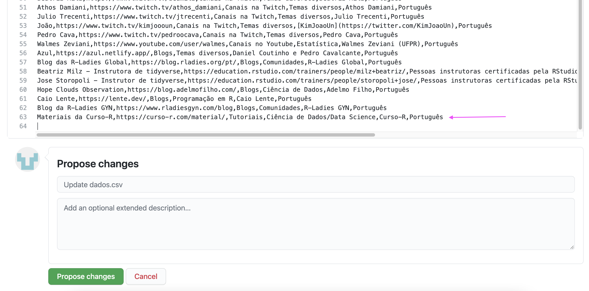
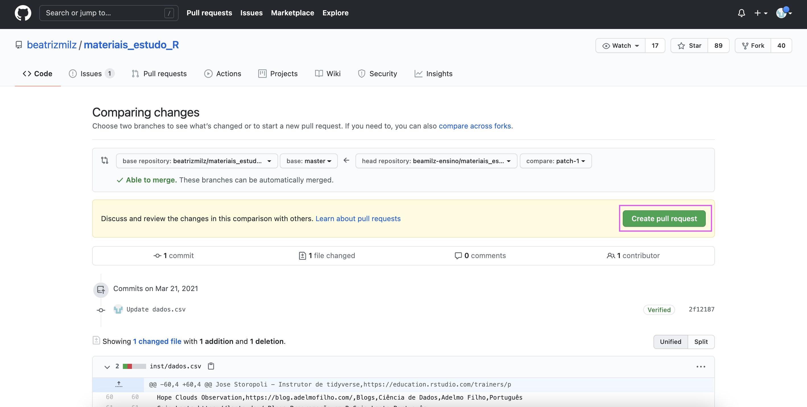

```{r setup, include=FALSE}
knitr::opts_chunk$set(echo = FALSE, out.width = "100%", fig.align = "center")
```

```{r metathis, echo=FALSE}
library(metathis)
meta() %>%
  meta_name("github-repo" = "beatrizmilz/materiais_estudo_R") %>% 
  meta_social(
    title = "Materiais em Português para estudar R!",
    description = paste(
      "Alguns materiais para estudo de R.",
      "Organizado por Beatriz Milz e várias pessoas da comunidade."
    ),
    url = "https://beatrizmilz.github.io/materiais_estudo_R/",
    image = "https://materiais-estudo-r.netlify.app/img/share-card.png",
    image_alt = paste(
      "Página sobre materiais para estudo de R"
    ),
    og_type = "website",
    og_author = "Beatriz Milz",
    twitter_card_type = "summary_large_image",
    twitter_creator = "@beamilz"
  )
```

Achou a lista interessante e gostaria de contribuir com o material de alguma forma? A seguir comentamos algumas formas de contribuir!

E se quiser saber quem são as pessoas que contribuem com essa lista, [clique aqui](contrib.html)!


## Sugerindo materiais para a lista

### Via GitHub

Uma das formas para contribuir é enviar novos materiais, através de uma contribuição no GitHub. Você pode fazer a contribuição diretamente do seu navegador (Google Chrome, Firefox, etc), não é necessário instalar nada no seu computador. Caso não tenha uma conta no GitHub, recomendo fazer uma, pois muitas coisas legais acontecem por lá na comunidade de R! 

As contribuições no GitHub são chamadas de Pull Requests. Nos passos abaixo veremos como fazer uma!

1. Os materiais ficam armazenados em uma tabela. Para sugerir um material, é necessário adicionar uma linha ao final dessa tabela! Entre no arquivo que vamos alterar: a tabela  [dados.csv](https://github.com/beatrizmilz/materiais_estudo_R/blob/master/inst/dados.csv).

2. A página aberta deve ser similar a imagem a seguir. Clique no lápis circulado em rosa.

```{r echo=FALSE}
knitr::include_graphics("img/pr_1.png")
```

3. A página aberta deve ser similar a imagem a seguir. Na aba **Edit file**, está o código da tabela que queremos alterar. Não se assuste! O mais importante é entender que cada linha é um material novo, cada coluna da tabela é separada por vírgula, e existe uma estrutura.

Atualmente é:

> nome do material,url do material na internet,categoria,tema principal,autoria,idioma


```{r echo=FALSE}
knitr::include_graphics("img/pr_2.png")
```
4. No final do arquivo, crie uma nova linha adicionando um novo material. Busque seguir a estrutura usada, e também usar as categorias já existentes (só crie uma nova caso seja realmente necessário!).

Nesse exemplo, adicionamos uma linha com o [material gratuito da Curso-R](https://curso-r.com/material/):

```{r echo=FALSE}

```

5. Só altere as linhas onde você sugeriu novos materiais, tome cuidado para não editar as outras linhas. Depois de escrever as suas sugestões, na aba **Propose changes** é possível verificar o que você alterou. 

```{r echo=FALSE}
knitr::include_graphics("img/pr_4.png")
```
6. A sua sugestão está completa? Agora podemos propor as modificações! Clique em **Propose changes**.

```{r echo=FALSE}
knitr::include_graphics("img/pr_5.png")
```

7. A página apresentará um resumo das mudanças realizadas. Mas até agora essas mudanças não estão no repositório da lista de materiais. Para isso, clique em **Create Pull Request**:
 
```{r echo=FALSE}

```

8. Estamos perto! Agora escreva um título pra sua contribuição, e se quiser, escreva um comentário no campo **Write**. O importante é ter um resumo do que foi a sua contribuição (adicionei um material, nesse caso). Depois de preencher, clique em **Create pull request**.

```{r echo=FALSE}
knitr::include_graphics("img/pr_7.png")
```

9. Parabéns! O pull request foi criado! Agora é necessário esperar até que eu (ou outra pessoa mantenedora) aceite essa contribuição. Após o aceite do Pull Request, em poucos minutos a sua sugestão deve aparecer no site.

```{r echo=FALSE}
knitr::include_graphics("img/pr_8.png")
```

### Sugerindo em uma issue

Caso você não esteja confortável fazendo um Pull Request, mas quer sugerir algum material, recomendo escrever uma issue, clicando [neste link](https://github.com/beatrizmilz/materiais_estudo_R/issues/new/choose), escrevendo quais são suas sugestões, e clicando em **Submit new issue**.

```{r echo=FALSE}
knitr::include_graphics("img/issue_1.png")
```

## Compartilhando o material

Você acha o material interessante? É muito útil compartilhar com pessoas que você conhece e que pode ser útil para elas. Além disso, é possível também compartilhar no Twitter, dando Retweet no tweet abaixo:

<a href="https://twitter.com/BeaMilz/status/1373451377813417987"> 
```{r tweet, echo=FALSE}
tweetrmd::tweet_screenshot("https://twitter.com/BeaMilz/status/1373451377813417987")
```
</a>

- [Veja a thread completa neste link!](https://twitter.com/BeaMilz/status/1373451377813417987)
